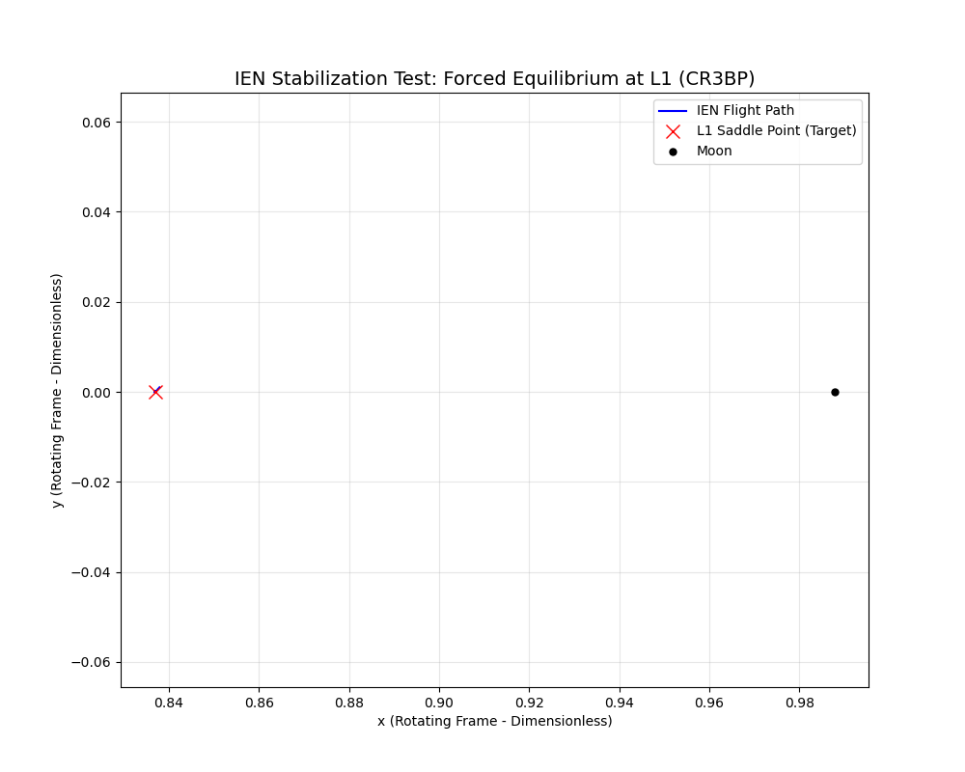

# IEN Phase 2: Chaotic Dynamics & Entropic Control (CR3BP)

## ⚠️ Experiment Context: Saddle Point Stabilization

This branch (`dev-cr3bp`) extends the **Information-Entropic Navigation (IEN)** protocol to the **Circular Restricted Three-Body Problem (CR3BP)** context, specifically within the Earth-Moon system.

### The Benchmark: "Hovering" at Instability
Unlike traditional trajectory design which seeks natural periodic orbits (Halo/Lissajous), this experiment attempts a mathematically more rigorous control challenge: **Forced Stabilization at the L1 Lagrange Point.**

* **Physical Challenge:** L1 is a saddle point (unstable equilibrium). Without active control, any deviation results in exponential divergence away from the point.
* **Objective:** We demonstrate that the IEN control law ($\mathbf{u} = -\nabla D_{KL}$) allows a spacecraft to maintain a static position ("Hovering") at L1.
* **Significance:** This serves as a "Stress Test" for the controller's authority against chaotic gravitational gradients, validating the entropic minimization logic before applying it to lower-energy manifold injections.

---

## 📉 Thermodynamic Unification

In this phase, we transition from chemical propellant metrics to **Thermodynamic Control Effort**. The IEN agent does not "burn fuel" in the impulsive sense; it minimizes the divergence between its internal belief (target state) and the environmental state.

### The Control Law
The control force emerges from the gradient of the Variational Free Energy (approximated here via precision-weighted error minimization):

$$\mathbf{u}^*_{IEN} = -\nabla D_{KL} \approx - (\Pi_x \cdot \mathbf{e}_x + \Pi_v \cdot \mathbf{e}_v)$$

Where $\Pi$ represents the **Precision Matrix** (Inverse Covariance) of the agent's internal model. High precision implies a high thermodynamic cost to suppress uncertainty.

### Metric: Entropic Cost ($J_H$)
We measure the cumulative effort required to maintain low-entropy state:
$$J_H = \int_{t_0}^{t_f} ||\mathbf{u}(t)|| dt$$
*In a physical implementation using Solar Radiation Pressure (SRP), this corresponds to the integrated momentum transfer required from the photon field.*

---

## 🎯 Results: Validation (Cold Start)

The simulation demonstrates **Target Lock** at the L1 point.
* **Initial State:** Zero velocity, minor positional displacement.
* **Outcome:** The agent dampens the instability immediately, maintaining the spacecraft within a micro-state of the target.


*(Figure 1: The IEN agent maintains a tight 'hover' at the L1 red cross, counteracting the gravitational pull of both Earth and Moon without entering a divergent orbit.)*

---

## 🛠️ Reproduction

### Prerequisites
* Python 3.8+
* NumPy, SciPy, Matplotlib

### Execution
To run the stabilization stress-test:

```bash
python cr3bp_ien.py
```

This will execute the numerical integration of the CR3BP equations of motion coupled with the Active Inference loop and generate the trajectory visualization.

---
📜 Citation
Brito, L. (2025). Information-Entropic Navigation (IEN): Active Inference for Low-Thrust Trajectory Optimization. Zenodo. https://doi.org/10.5281/zenodo.17930558