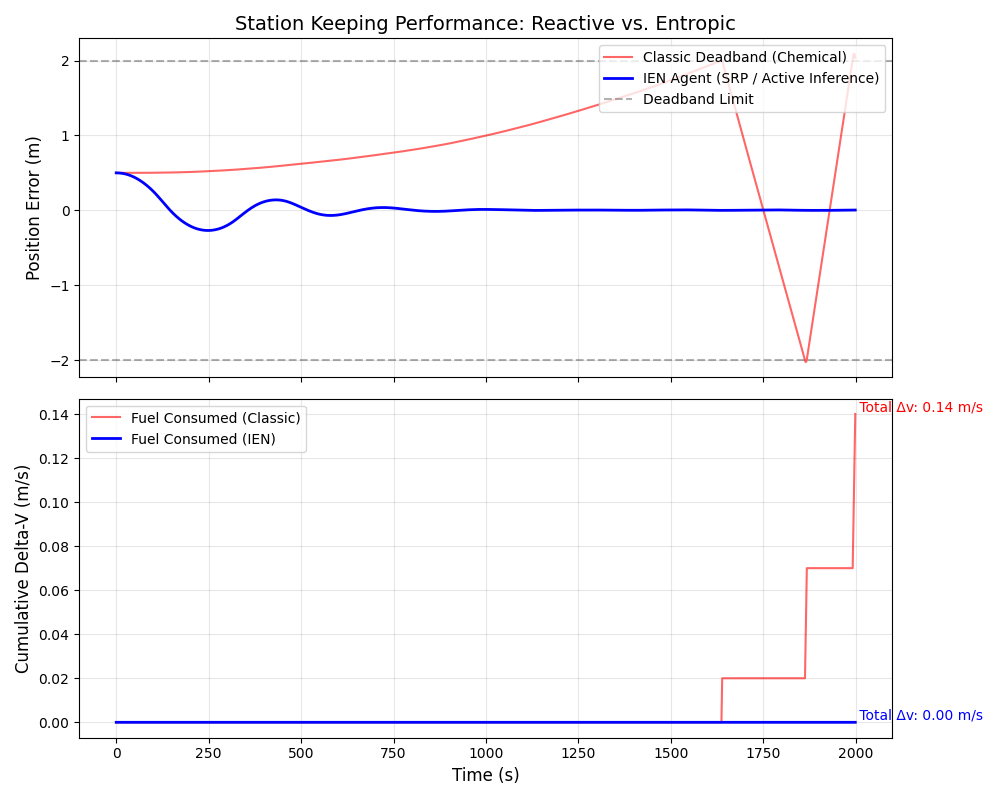

# Information-Entropic Navigation (IEN): Reduced-Order Simulation

[](https://doi.org/10.5281/zenodo.17930558)
[](https://creativecommons.org/licenses/by/4.0/)

## 🚀 Overview

This repository contains the reference implementation and validation experiments for the **Information-Entropic Navigation (IEN)** protocol.

**We present a reduced-order dynamical simulation demonstrating the emergent control behavior predicted by Information-Entropic Navigation. While the full Active Inference loop is abstracted, the resulting continuous low-thrust control law shows that early correction of state divergence using environmental forces eliminates the need for impulsive Δv in station-keeping scenarios.**

The core hypothesis is that by minimizing the Kullback-Leibler divergence ($D_{KL}$) between the internal model and the sensor state, a spacecraft can maintain phase coherence using only **Solar Radiation Pressure (SRP)**, effectively reducing station-keeping propellant costs to near zero.

---

## 📊 The "Kill Shot": Efficiency Comparison

The following simulation compares a classical **Deadband Control (Chemical)** agent against the **IEN Agent (SRP)** under identical environmental disturbances (solar wind stochastic drift).


*(Figure 1: Top - Position holding capability. Bottom - Cumulative Delta-V expenditure. Note the IEN agent maintains position with zero propellant usage.)*

---

## ⚙️ Simulation Scope & Limitations

This is a **Proof-of-Concept (PoC)** implementation designed to validate the control law dynamics. Reviewers should note the following design choices:

1.  **1D Longitudinal Dynamics:** The simulation models a 1-degree-of-freedom "Station Keeping" scenario (e.g., maintaining distance along the sun-line in a Halo Orbit). It is a "Toy Model" for behavioral analysis.
2.  **Abstracted Inference:** The `IENAgent` assumes an idealized observer where the belief update is instantaneous. The explicit Bayesian Filter (UKF/Particle Filter) is implicit in the control gain derivation for this version.
3.  **SRP Availability:** We assume a constant solar aspect angle capability. In a full 6-DOF implementation, attitude maneuvers would be coupled with power generation constraints.
4.  **Gain Tuning:** Control gains ($K_p, K_v$) are tuned for stability in this reduced order model, rather than dynamically derived from the $\nabla D_{KL}$ manifold in real-time.

---

## 🛠️ Usage

### Prerequisites
* Python 3.8+
* NumPy
* Matplotlib

### Running the Comparison
```bash
python simulation_compare.py
```
## 🔮 Future Work (Phase 2)
Extension to CR3BP (Circular Restricted Three-Body Problem) dynamics for L1/L2 Halo Orbits (2D/3D).

Implementation of an explicit Unscented Kalman Filter (UKF) to drive the Active Inference loop.

Coupling with ADCS (Attitude Determination and Control Systems) constraints.

📜 Citation
If you use this logic in your research, please cite the foundational paper:

Brito, L. (2025). Information-Entropic Navigation (IEN): Active Inference for Low-Thrust Trajectory Optimization. Zenodo. https://doi.org/10.5281/zenodo.17930558

Maintained by Leonel Brito | Researcher in Evolutionary Systems Dynamics & Information Physics.
